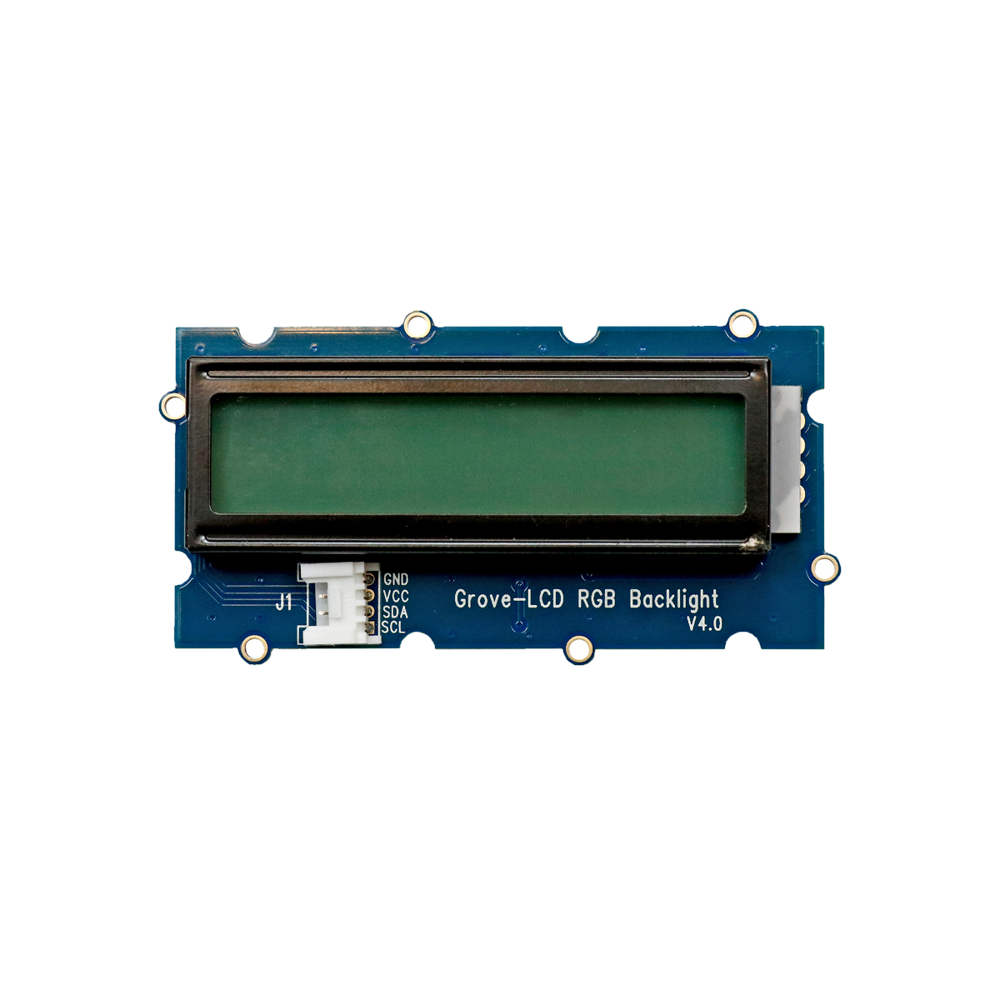

# LCD-Bildschirm

## Beschreibung
Der LCD Bildschirm ist ein bisschen wie der Bildschirm dieses Laptops, nur *viel* einfacher. Aber genau gleich wie bei einem Laptop kann er dazu benutzt werden, um Informationen anzuzeigen. Der Bildschirm verfügt über zwei Zeilen, auf denen jeweils 16 Zeichen (Buchstaben, Zahlen und Sonderzeichen) dargestellt werden können. Zusätzlich lässt sich die Farbe der Hintergrundbeleuchtung steuern, um einen besonderen Effekt zu erzeugen. Der Bildschirm kann direkt oder mithilfe des Grove Shields an einen Arduino oder Raspberry Pi über die serielle Schnittstelle I2C angeschlossen werden.

### Video

@[youtube](https://www.youtube.com/watch?v=PWh7wkT2Dog)

### Aufbau

1. Schließe das LCD an einen der I2C Pins des Grove-Shields an.
1. Klicke am linken Rand der Arduino IDE auf den Knopf mit Büchersymbol (das ist der Bibliotheksverwalter) und suche nach `Grove LCD RGB Backlight`, klicke anschließend auf installieren. Das ist eine Bibliothek mit Code, damit man den LCD leicht bedienen kann.
1. Lade den Beispielcode unten auf den Arduino und führe ihn aus.
1. Auf dem LCD wird nun `Hallo, Welt!` und die Sekunden ab Programmstart angezeigt.
1. Danach kannst du folgendes machen:
    - Ändere den Code so ab, dass in der ersten Zeile ‘Easy’ und in der zweiten Zeile ‘Sommer’ steht.
    - Ändere die Hintergrund-Farbe z.B. auf ein schönes Violett ;-)
    - Erkunde auch die weiteren Beispiele den Bildschirm: Zu finden unter `Datei - Beispiele - Grove LCD RGB Backlight - XXX`

## Codebeispiele

!!!show-examples:./examples/

 

## Wichtige Links für die ersten Schritte:

Alle weiteren Hintergrundinformationen sowie ein Beispielaufbau und alle notwendigen Programmbibliotheken sind auf dem offiziellen Wiki (bisher nur in englischer Sprache) von Seeed Studio zusammengefasst. Zusätzlich findet man über alle gängigen Suchmaschinen meist nur mit der Eingabe der genauen Komponenten-Bezeichnungen entsprechende Projektbeispiele und Tutorials.

- [Seeed Studio Wiki](http://wiki.seeedstudio.com/Grove-LCD_RGB_Backlight/) [- LCD Display](http://wiki.seeedstudio.com/Grove-LCD_RGB_Backlight/)

## Projektbeispiele:

- [Funduino - I2C Display](https://funduino.de/nr-19-i%C2%B2c-display)

## Weiterführende Hintergrundinformationen:

- [I2C - Wikipedia Artikel](https://de.wikipedia.org/wiki/I%C2%B2C)
- [SPI - Wikipedia Artikel](https://de.wikipedia.org/wiki/Serial_Peripheral_Interface)
- [UART - Wikipedia Artikel](https://de.wikipedia.org/wiki/Universal_Asynchronous_Receiver_Transmitter)
- [GitHub-Repository: LCD-Bildschirm](https://github.com/MakeYourSchool/62-LCD-Bildschirm)

